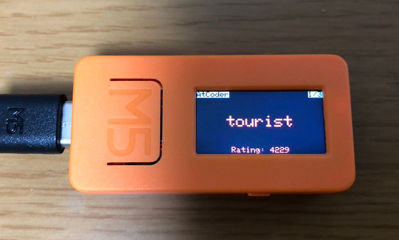

AtCoder Badges for M5StickC
=====

インストール方法
-----
1. M5StickCを用意します。
2. このリポジトリをクローンします。
3. m5stick-c-atcoder.inoの、SSIDとPASSWORDをお使いのルーターのものにセットします。
4. m5stick-c-atcoder.inoのUSERSに登録したいユーザーを列挙します。
5. M5SticｋCのArduino開発環境を整えたArduino IDEでこのSketchを書き込みます。

使い方
-----
### M5ボタン
次のユーザーを表示する。

### 画面の下のボタン
レート情報をリロードする。
